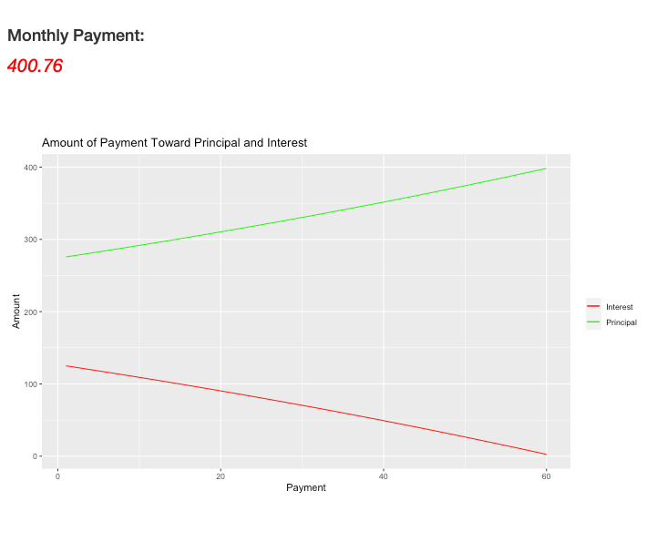

```{r setup, include=FALSE}
knitr::opts_chunk$set(echo = FALSE)
```

## Amortization Calculation App


This is a simple app to calculation a loan payment.

Many people need to get loans for a variety of reasons.

It is necessary to know what your monthly loan payment would be from a set of loan parameters.

This app will calculate your payment and display a graph of the break down of interest and principal for the life of the loan. 


## Directions

Step 1 - Click on 'Application' in the side panel

Step 2 - Enter total loan amount in the first input box

Step 3 - Enter down payment in the second input box

Step 4 - Use slider to set the loan length in years

Step 5 - Use slider to set the interest rate

Step 6 - Click on 'Calculate' to find payment and see a graph of interest and principal over the life of the loan


## Data input on App

Example Output from App!

{width=600px}

## Details

App can be found at:  https://waitt96411.shinyapps.io/coursera_data_products/

The github respository, https://github.com/gmw12/Coursera_Data_Products, contains the server.R and ui.R files and this presentation.


